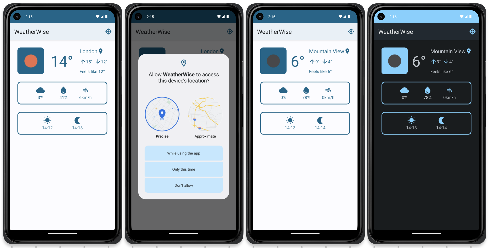

# WeatherWise

## About

### Description

WeatherWise is a pet-project that provides the ability to view the weather

### Architecture

Clean Architecture with MVVM Pattern

### Technologies

- Kotlin (with Coroutines)
- Retrofit
- OkHttp
- Dagger-Hilt
- LiveData
- Coil
- DataStore
- DataBinding

### Screenshots

